<div align="center">

# Karman Singh

```bash
karman@github:~$ whoami --status
```
*B.Tech CSE (AI/ML) • 2nd Year • Building at the intersection of Intelligent Systems, Full-Stack & Web3*

<br>

<!-- ================= CONTRIBUTION HEATMAP ================= -->
<p align="center">
  
</p>

<br>

<!-- ================= DEVELOPER INFO CARD ================= -->
<p align="center">
  
</p>

</div>

<br>

### `karman@github ~ $ ls -la ./projects/`

```bash
drwxr-xr-x  karman  staff  256B  active-deployments/
```

| Deployment / Repository | Focus & Architecture | Status |
| :--- | :--- | :---: |
| [**RoadEye / NetraFlow**](https://github.com/Karmansingh09) | AI-powered multi-camera ANPR trajectory tracking and urban traffic analytics system | `PRODUCTION` |
| [**Confidential P2P Micro-Lending**](https://github.com/Karmansingh09) | Privacy-preserving decentralized peer-to-peer micro-lending desk engineered on Midnight Network | `ACTIVE` |
| [**CeloAgent**](https://github.com/Karmansingh09) | Autonomous on-chain AI agent spending, budget allocation, and policy verification framework | `STABLE` |
| [**MiniSwap**](https://github.com/Karmansingh09) | Web3 automated market maker (AMM) protocol and decentralized liquidity pool exchange | `DEPLOYED` |

<br>

### `karman@github ~ $ cat /etc/environment`

```yaml
system:
  profile: Karman Singh
  role: Computer Science & Engineering (Artificial Intelligence / Machine Learning)
  stage: Undergraduate (2nd Year)
  stack:
    core: [C, Python, TypeScript, JavaScript, Java]
    frontend: [React, Next.js, Vite, Tailwind CSS]
    backend: [Node.js, Express, MongoDB]
    web3: [Celo, Midnight Network, Stellar, Solidity]
    devops_tools: [Git, GitHub, Docker, Linux]
```

<br>

<div align="center">

```
[ EOF — karman@github:~$ exit 0 ]
```

</div>
